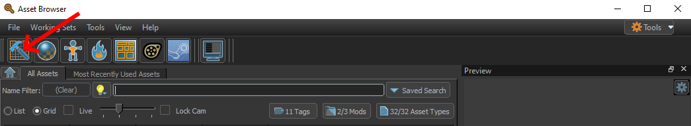
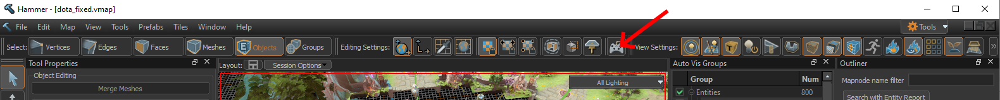
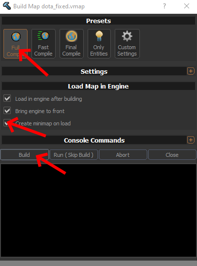
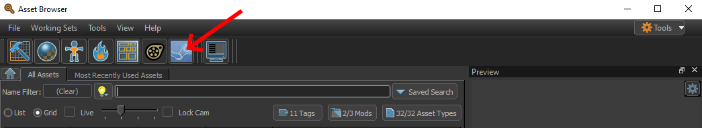
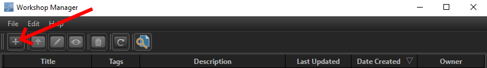

# Dota But Numbers Generator

This template is a nice and simple generator to create numbers custom game mods for Dota 2. 

It is designed to be as simple as possible at it's core, allowing you to just enter a formula, create the mod folders with one simple click, having you only need to build and upload in the Dota 2 Workshop Tools.

However, it is also designed to be very extensible, allowing you to hook into many different steps of the generation process, doing advanced filtering, specific operations, extrapolation and complex logic leveraging the full potential of the JavaScript scripting language.

## Prerequisites

### Skills

- Basic Maths (+, -, *, /)
- Follow simple instructions (in this Guide)
- [Optional] Basic programming (conditionals, functions, ...)
- [Optional] "Advanced" Maths (function behaviour like 1-x, 1/x, sin, cos, pow, log, ...)
- [Optional] Knowledge of git (to save / share your mods online with other creators)
- [Optional][Advanced] Advanced programming (only if you want more complex logic or manipulate things not supported by default and want to look into the module code)

### Tools

- Text Editor (I recommend [VS Code](https://code.visualstudio.com/))
- [NodeJS](https://nodejs.org/en/) (either LTS or Current - JavaScript runtime used to generate KV files)
- [Dota 2 Workshop Tools](https://developer.valvesoftware.com/wiki/Dota_2_Workshop_Tools/Installing_and_Launching_Tools)
- [Optional] [Git](https://git-scm.com/) (Version Control System used to track modifications and share code)


## How to create a mod

1. [Download](https://github.com/drteaspoon420/Dota-But-Numbers-Generator/archive/refs/heads/main.zip) and extract the files of this project.

2. For a basic mod you only need to modify one file: `settings.js` located in the root directory of the project. Open this file in the text editor of your choice.

3. Edit the `name` field to give your mod an appropriate name. This is just the name of the files and the workshop tools, the name displayed in Dota will be set in the workshop tools.

4. Adjust the `targetDirectory` field to point to a folder you'll want to manage the mod in [be sure to use `\\` instead of `/` to separate directories].

5. Adjust the `dotaPath` field to point to the root folder of Dota 2 located in the `SteamApps\common` folder (either `dota 2` or `dota 2 beta`) [be sure to use `\\` instead of `/` to separate directories].

6. Adjust the `generate` field to determine what kind of things should be modified.

7. Adjust the following sections for units, heroes, items and abilities

    - For simple mods it should be enough to modify the transformation functions and possibly blacklist and whitelist entries (the defaults are set to be fine for most mods). 
    - Reference the default settings file for how these transformation functions work. Either use the provided transformation functions like `transformations.times(X)` or enter your own formula like `(current) => current + 10`

8. Run the `run.bat` file and wait for it to complete.

9. Basically done. The generator has set up all necessary files for the mod to be released. The only thing left is [building and uploading the mod in the workshop tools](#Builing-and-Uploading-a-Mod-in-the-Workshop-Tools).

## Advanced mod-making

This section discusses some more advanced ways on how to set up your config. Programming knowledge is useful but still not necessarily required.


### Transformation functions

Transformation functions are the core of numbers mods made with this template. These functions in the form of `(current, scaling, level, key) => number` are called for each KV value that is included by filters.

The function just needs to return any number for the new KV value. You can used the passed arguments to calculate this value.

| Argument | Description                                                       |
|----------|-------------------------------------------------------------------|
| current  | The original KV value                                             |
| scaling  | This is only used for interpolation (see [skill interpolation]()) |
| level    | The level of an ability                                           |
| key      | The key of the KV value                                           |

Here you can also use fancy logic to i.e. have different calculations for different keys.

Example:

```
let abilityTransformationFunction = (current, scaling, level, key) => {
    if (key === "AbilityCoolodown)
    {
        return Math.floor(current / 2 + 10 / level);
    }
    else
    {
        return current * 10;
    }
};
```

### Filter functions

There are 2 uses of filters: `shouldProcessKey` and `shouldProcessField`.

`shouldProcessKey` filters on the top level keys. Those are things like individual heroes, items, abilities or units and are listed in `docs/keys_*.txt`.

`shouldProcessFields` filters on the all other fields. Those are things like AbilityManaCost, ItemCost, AttackRate, ... and are listed in `docs/fields_*.txt`.

These filter functions are in the form of `(key, depth) => (true|false)` and determine whether that key/field should be handled.

There are you can write your own filter function but in most cases you can just use the functions defined in `filter-functions.js`. In the easiest case this just consists of easy whitelist or blacklist functions, however you can also combine different functions.

Example:

```
let customFieldFilter = or(whitelist(['somefiled', 'someotherfield']), not(depth(1)))
```

### Additional transformation functions


### Extrapolating ability levels


## Builing and Uploading a Mod in the Workshop Tools

1. Open the Workshop Tools by launching Dota 2 from Steam and selecting "Launch Dota 2 - Tools"

2. Select your mod in the list at the bottom of the opened window (if your mod name doesn't show up make sure you have properly set `dotaPath` in `settings.js` and re-run `run.bat`)

3. Open Hammer using the hammer icon in the bar at the top


4. Load the map into Hammer by going into `File -> Open -> TargetDirectory/ModName/content/maps/dota_fixed.vmap`

5. Open the build settings using the gamepad icon in the bar at the top of hammer


6. Activate "Create minimap on load" and klick "Build" (this is only required once, after that you can just test using "Run (Skip Build)") and wait for the build to finish.


7. After the build is done Dota should start automatically. Test your modifications to see if everything works as expected.

8. Go back to the "Asset Browser" window opened at the start and open the upload settings using the steam icon in the bar at the top


9. [Optional but nice] Create a custom loading screen image by modifying `TargetDirectory/ModName/content/panorama/images/custom_game/loading_screen.png`

10. [Optional but nice] Create a custom preview image version of that with the dimensions 1024x768px

11. Create a new submission using the "+" button at the top


12. Add all data and select the preview image, then submit, confirm email to your steam account and wait for steam approval (usually < 1 day)

13. Done, you've created your first mod! Feel free to join this [discord](https://discord.gg/UrykCHAHsb) and share your mod there. There is a good chance your mod will be played on stream.

## Having issues?

Create a new issue in this repository.

A good way to phrase these issues is:

- What is it that I want to achieve? (in terms of result, not action [see [XY Problem](https://xyproblem.info/)])
- What did you try so far? (give instructions that would allow someone else to reproduce it on their end)
- What was your expected outcome?
- What was the actual outcome?
